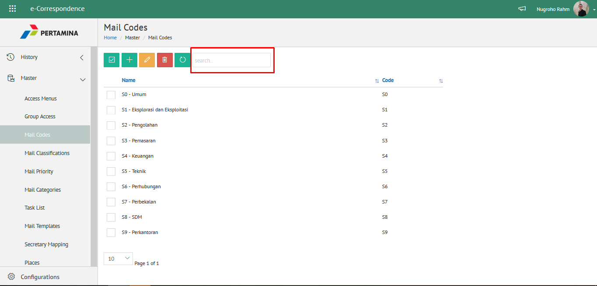
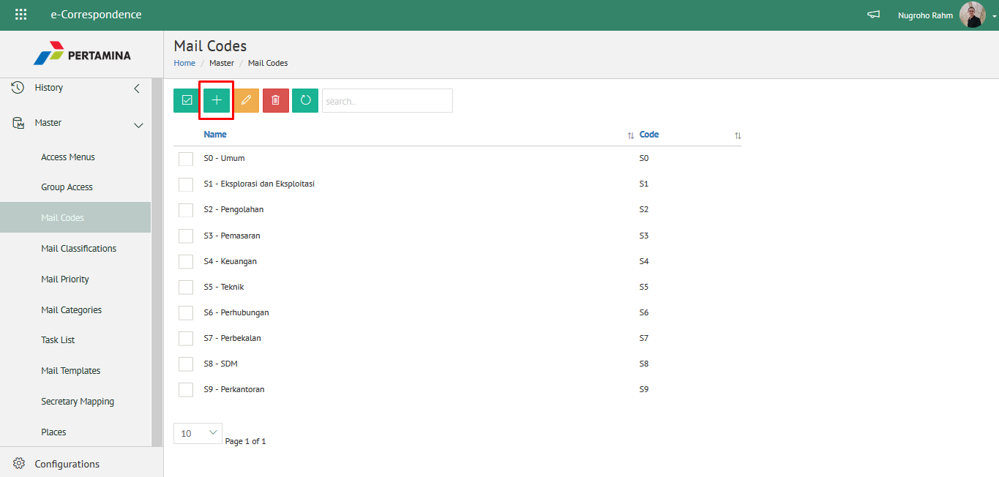
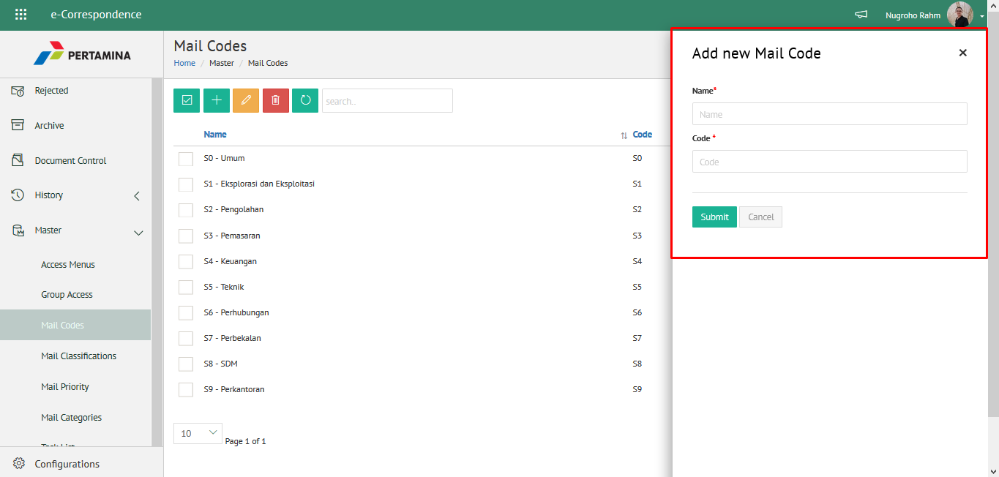
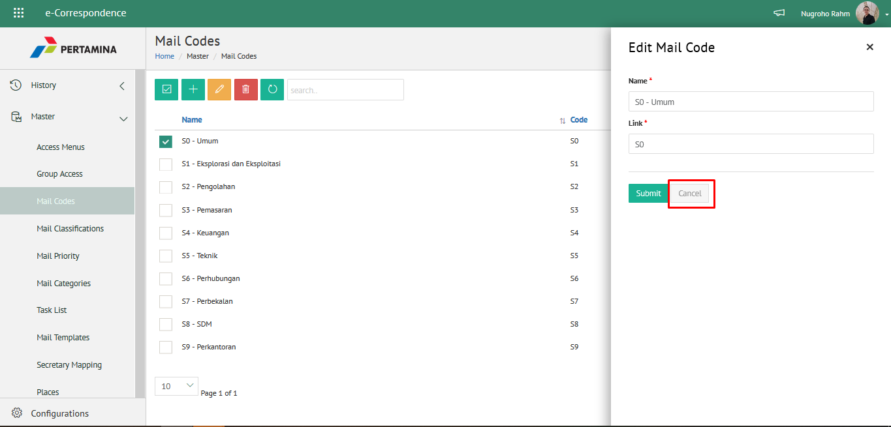
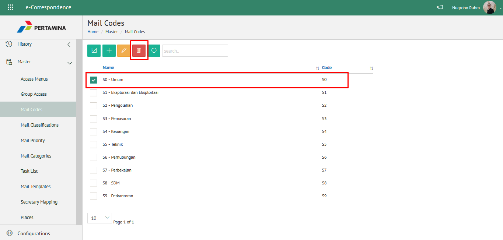
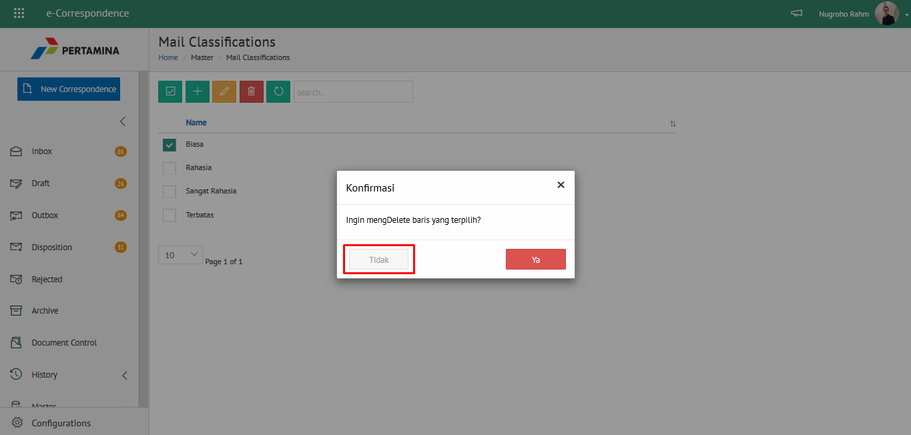
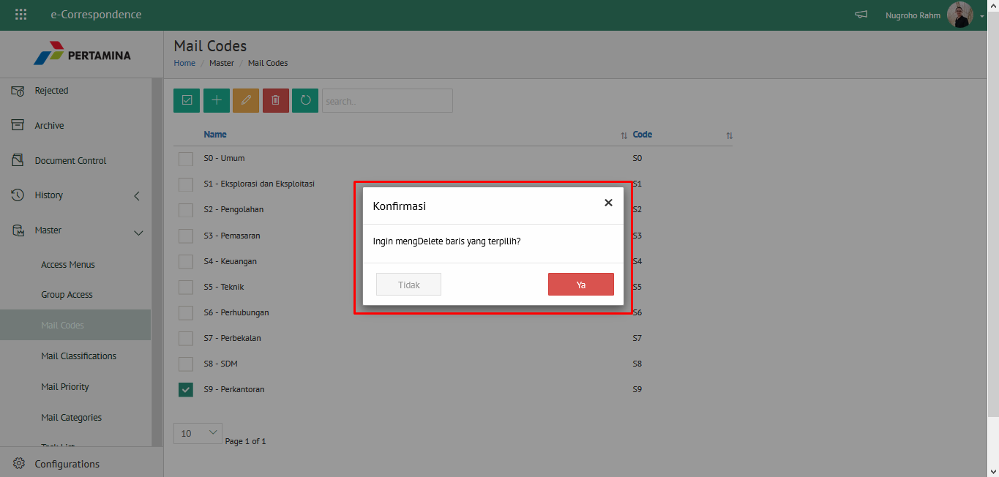

### 1. Mengelola Kode Simpan

**Role yang sesuai**

- Admin eCorr

Admin eCorr dapat mengelola kode simpan yang digunakan dalam penginputan form surat. Pengelolaan kode simpan yang dilakukan 
admin eCorr antara lain yaitu:

- Mencari kode simpan
- Menambah kode simpan
- Mengubah kode simpan
- Menghapus kode simpan

Langkah-langkah untuk pengelolaan kode simpan adalah sebagai berikut:

#### 1.1. *Mencari Kode Simpan*

1. Pilih menu **Master** dan pilih submenu **Mail Code**

2. Pilih tombol **Search** dan masukkan pencarian berdasarkan kata kunci, kemudian klik **Enter**

#### 1.2. *Menambah Kode Simpan*

1. Pilih menu **Master** dan pilih submenu **Mail Code**

2. Pilih tombol &quot;+&quot; untuk menambah kode simpan

3. Isikan informasi kode simpan meliputi nama dan kode kemudian klik tombol **Submit**

4. Sistem menyimpan perubahan dan data akan muncul di halaman daftar kode simpan

#### 1.3. *Mengubah Kode Simpan*

1. Pilih menu **Master** dan pilih submenu **Mail Code**

2. Klik checklist pada kode simpan yang akan diubah kemudian klik icon **Ubah**

3. Lakukan perubahan pada kode simpan, pilih **Cancel **untuk membatalkan proses

4. Lakukan perubahan pada kode simpan kemudian klik tombol **Submit** untuk menyimpan perubahan

5. Sistem menyimpan perubahan dan data akan muncul di halaman daftar kode simpan
   
#### 1.4 *Menghapus Kode Simpan*

1. Pilih menu **Master** dan pilih submenu **Mail Code**

2. Klik checklist pada kode simpan yang akan dihapus kemudian klik icon **Delete**

3. Klik tombol **Tidak** untuk membatalkan proses

4. Klik tombol **Ya** untuk menghapus kode simpan. Sistem menyimpan perubahan dan data akan terhapus dari daftar kode simpan

