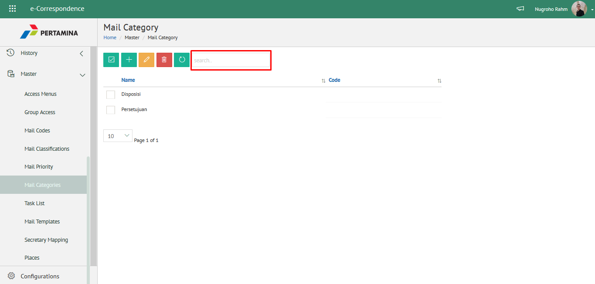

## Data Master

Pada modul ini mendukung pengelolaan data master yang digunakan pada aplikasi eCorr meliputi data master menu akses, grup 
akses, kode simpan, klasifikasi surat, prioritas surat, kategori surat, *task list* SP3S, lokasi, mengelola secretary mapping 
dan mendukung custom template surat

### 1. Mengelola Kode Simpan

**Role yang sesuai**

- Admin eCorr

Admin eCorr dapat mengelola kode simpan yang digunakan dalam penginputan form surat. Pengelolaan kode simpan yang dilakukan 
admin eCorr antara lain yaitu:

- Mencari kode simpan
- Menambah kode simpan
- Mengubah kode simpan
- Menghapus kode simpan

Langkah-langkah untuk pengelolaan kode simpan adalah sebagai berikut:

#### 1.1. *Mencari Kode Simpan*

1. Pilih menu **Master** dan pilih submenu **Mail Code**

2. Pilih tombol **Search** dan masukkan pencarian berdasarkan kata kunci, kemudian klik **Enter**

#### 1.2. *Menambah Kode Simpan*

1. Pilih menu **Master** dan pilih submenu **Mail Code**

2. Pilih tombol &quot;+&quot; untuk menambah kode simpan

3. Isikan informasi kode simpan meliputi nama dan kode kemudian klik tombol **Submit**

4. Sistem menyimpan perubahan dan data akan muncul di halaman daftar kode simpan

#### 1.3. *Mengubah Kode Simpan*

1. Pilih menu **Master** dan pilih submenu **Mail Code**

2. Klik checklist pada kode simpan yang akan diubah kemudian klik icon **Ubah**

3. Lakukan perubahan pada kode simpan, pilih **Cancel **untuk membatalkan proses

4. Lakukan perubahan pada kode simpan kemudian klik tombol **Submit** untuk menyimpan perubahan

5. Sistem menyimpan perubahan dan data akan muncul di halaman daftar kode simpan
   
#### 1.4 *Menghapus Kode Simpan*

1. Pilih menu **Master** dan pilih submenu **Mail Code**

2. Klik checklist pada kode simpan yang akan dihapus kemudian klik icon **Delete**

3. Klik tombol **Tidak** untuk membatalkan proses

4. Klik tombol **Ya** untuk menghapus kode simpan. Sistem menyimpan perubahan dan data akan terhapus dari daftar kode simpan

### 2. Mengelola Klasifikasi Surat  

**Role yang sesuai:**

- Admin eCorr

Admin eCorr dapat mengelola klasifikasi surat yang digunakan dalam penginputan form surat. Pengelolaan klasifikasi surat yang dilakukan admin eCorr antara lain yaitu:

- Mencari klasifikasi surat
- Menambah klasifikasi surat
- Mengubah klasifikasi surat
- Menghapus klasifikasi surat

Langkah-langkah untuk pengelolaan klasifikasi surat adalah sebagai berikut:

#### 2.1. *Mencari Klasifikasi surat*

1. Pilih menu **Master** dan pilih submenu **Mail Classification**

1. Pilih tombol **Search** dan masukkan pencarian berdasarkan kata kunci, kemudian klik **Enter**

#### 2.2. *Menambah Klasifikasi Surat*

1. Pilih menu **Master **dan pilih submenu **Mail Classification**

2. Pilih tombol &quot;+&quot; untuk menambah klasifikasi surat

3. Isikan informasi klasifikasi surat meliputi nama kemudian klik tombol **Submit**

4. Sistem menyimpan perubahan dan data akan muncul di halaman daftar klasifikasi surat

#### 2.3. *Mengubah Klasifikasi Surat*

1. Pilih menu **Master** dan pilih submenu **Mail Classification**    

2. Klik checklist pada klasifikasi surat yang akan diubah kemudian klik icon **Ubah**

3. Lakukan perubahan pada klasifikasi surat, pilih **Cancel** untuk membatalkan proses

4. Lakukan perubahan pada klasifikasi surat kemudian klik tombol **Submit**

5. Sistem menyimpan perubahan dan data akan muncul di halaman daftar klasifikasi surat
   
#### 2.4. *Menghapus Klasifikasi Surat*

1. Pilih menu **Master** dan pilih submenu **Mail Classification**

2. Klik checklist pada klasifikasi surat yang akan dihapus kemudian klik icon **Delete**

3. Klik tombol **Cancel** untuk membatalkan proses

4. Klik tombol **Ya** untuk menghapus klasifikasi surat

5. Sistem menyimpan perubahan dan data akan terhapus dari daftar klasifikasi surat
   

### 3. Mengelola Prioritas surat 

**Role yang sesuai:**
- Admin eCorr

Admin eCorr dapat mengelola prioritas surat yang digunakan dalam penginputan form surat. Pengelolaan prioritas surat yang dilakukan admin eCorr antara lain yaitu:

- Mencari prioritas surat
- Menambah prioritas surat
- Mengubah prioritas surat
- Menghapus prioritas surat

Langkah-langkah untuk pengelolaan prioritas surat adalah sebagai berikut:

#### 3.1. *Mencari Prioritas Surat*

1. Pilih menu **Master** dan pilih submenu **Mail Priority**

2. Pilih tombol **Search** dan masukkan pencarian berdasarkan kata kunci, kemudian klik **Enter**

#### 3.2. *Menambah Prioritas Surat*

1. Pilih menu **Master** dan pilih submenu **Mail Priority**

2. Pilih tombol &quot;+&quot; untuk menambah prioritas surat

3. Isikan informasi prioritas surat meliputi nama kemudian klik tombol **Submit**

4. Sistem menyimpan perubahan dan data akan muncul di halaman daftar prioritas surat

#### 3.3. *Mengubah Prioritas Surat*

1. Pilih menu **Master** dan pilih submenu **Mail Priority**

2. Klik checklist pada prioritas surat yang akan diubah kemudian klik icon **Ubah**

3. Lakukan perubahan pada prioritas surat, pilih **Cancel** untuk membatalkan proses

4. Lakukan perubahan pada prioritas surat kemudian klik tombol **Submit**

5. Sistem menyimpan perubahan dan data akan muncul di halaman daftar prioritas surat
   
#### 3.4. *Menghapus Prioritas Surat*

1. Pilih menu **Master** dan pilih submenu **Mail Priority**

2. Klik checklist pada prioritas surat yang akan dihapus kemudian klik icon **Delete**

3. Klik tombol **Cancel** untuk membatalkan proses

4. Klik tombol **Ya **untuk menghapus prioritas surat

5. Sistem menyimpan perubahan dan data akan terhapus dari daftar prioritas surat
   

### 4. Mengelola Kategori Surat 

**Role yang sesuai:**

- Admin eCorr

Admin eCorr dapat mengelola kategori surat yang digunakan dalam penginputan form surat masuk dan fax masuk. Pengelolaan kategori surat yang dilakukan admin eCorr antara lain yaitu:

- Mencari kategori surat
- Menambah kategori surat
- Mengubah kategori surat
- Menghapus kategori surat

Langkah-langkah untuk pengelolaan kategori surat adalah sebagai berikut:

#### 4.1. *Mencari Kategori Surat*

1. Pilih menu **Master** dan pilih submenu **Mail Categories**

2. Pilih tombol **Search** dan masukkan pencarian berdasarkan kata kunci, kemudian klik **Enter**

#### 4.2. *Menambah Kategori Surat*

1. Pilih menu **Master** dan pilih submenu **Mail Categories**

2. Pilih tombol &quot;+&quot; untuk menambah kategori surat

3. Isikan informasi kategori surat meliputi nama kemudian klik tombol **Submit**

4. Sistem menyimpan perubahan dan data akan muncul di halaman daftar kategori surat
   
#### 4.3. *Mengubah Kategori Surat*

1. Pilih menu **Master** dan pilih submenu **Mail Categories**

2. Klik checklist pada kategori surat yang akan diubah kemudian klik icon **Ubah**

3. Lakukan perubahan pada kategori surat, pilih **Cancel** untuk membatalkan proses

4. Lakukan perubahan pada kategori surat kemudian klik tombol **Submit**

5. Sistem menyimpan perubahan dan data akan muncul di halaman daftar kategori surat
 
####   4.4. *Menghapus Kategori Surat*

1. Pilih menu **Master** dan pilih submenu **Mail Categories**

2. Klik checklist pada kategori surat yang akan dihapus kemudian klik icon **Delete**

3. Klik tombol **Cancel** untuk membatalkan proses

4. Klik tombol **Ya** untuk menghapus kategori surat

5. Sistem menyimpan perubahan dan data akan terhapus dari daftar kategori surat

### 5. Mengelola *Task List* SP3S  

**Role yang sesuai:**

- Admin eCorr

Admin eCorr dapat mengelola *task list* yang digunakan dalam penginputan form pengajuan SP3S. Pengelolaan *task list* SP3S yang dilakukan admin eCorr antara lain yaitu:

- Mencari *task list* SP3S
- Menambah *task list* SP3S
- Mengubah *task list* SP3S
- Menghapus *task list* SP3S

Langkah-langkah untuk pengelolaan *task list* SP3S adalah sebagai berikut:

#### 5.1. *Mencari Task List SP3S*

1. Pilih menu **Master** dan pilih submenu ***Task list***

1. Pilih tombol **Search** dan masukkan pencarian berdasarkan kata kunci, kemudian klik **Enter**

#### 5.2. *Menambah Task List SP3S*

1. Pilih menu **Master** dan pilih submenu ***Task list***

2. Pilih tombol &quot;+&quot; untuk menambah *task list*

3. Isikan informasi *task list* meliputi nama kemudian klik tombol **Submit**

4. Sistem menyimpan perubahan dan data akan muncul di halaman daftar *task list*

#### 5.3. *Mengubah Task List SP3S*

1. Pilih menu **Master** dan pilih submenu ***Task list***

2. Klik checklist pada *task list* yang akan diubah kemudian klik icon **Ubah**

3. Lakukan perubahan pada *task list*, pilih **Cancel** untuk membatalkan proses

4. Lakukan perubahan pada *task list* kemudian klik tombol **Submit**

5. Sistem menyimpan perubahan dan data akan muncul di halaman daftar *task list*

#### 5.4. *Menghapus Task List SP3S*

1. Pilih menu **Master** dan pilih submenu ***Task list***

2. Klik checklist pada *task list* yang akan dihapus kemudian klik icon **Delete**

3. Klik tombol **Cancel** untuk membatalkan proses

4. Klik tombol **Ya** untuk menghapus *task list*

5. Sistem menyimpan perubahan dan data akan terhapus dari daftar *task list*

### 6. Mengelola Tempat

**Role yang sesuai:**

- Admin eCorr

Admin eCorr dapat mengelola tempat/lokasi yang digunakan dalam penginputan form surat. Pengelolaan data master lokasi yang dilakukan admin eCorr antara lain yaitu:

- Mencari data master tempat
- Menambah data master tempat
- Mengubah data master tempat
- Menghapus data master tempat

Langkah-langkah untuk pengelolaan tempat/lokasi surat adalah sebagai berikut:

#### 6.1. *Mencari Tempat*

1. Pilih menu **Master** dan pilih submenu **Places**

2. Pilih tombol **Search **dan masukkan pencarian berdasarkan kata kunci, kemudian klik **Enter**

#### 6.2. *Menambah Tempat*

1. Pilih menu **Master** dan pilih submenu **Places**

2. Pilih tombol &quot;+&quot; untuk menambah tempat

3. Isikan informasi tempat meliputi nama kemudian klik tombol **Submit**

4. Sistem menyimpan perubahan dan data akan muncul di halaman daftar tempat

#### 6.3. *Mengubah Tempat*

1. Pilih menu **Master** dan pilih submenu **Places**

2. Klik checklist pada tempat yang akan diubah kemudian klik icon **Ubah**

3. Lakukan perubahan pada tempat, pilih **Cancel** untuk membatalkan proses

4. Lakukan perubahan pada tempat kemudian klik tombol **Submit**

5. Sistem menyimpan perubahan dan data akan muncul di halaman daftar tempat

#### 6.4. *Menghapus Kategori Surat*

1. Pilih menu **Master **dan pilih submenu **Mail Categories**

2. Klik checklist pada tempat yang akan dihapus kemudian klik icon **Delete**

3. Klik tombol **Cancel** untuk membatalkan proses

4. Klik tombol **Ya** untuk menghapus tempat

5. Sistem menyimpan perubahan dan data akan terhapus dari daftar tempat