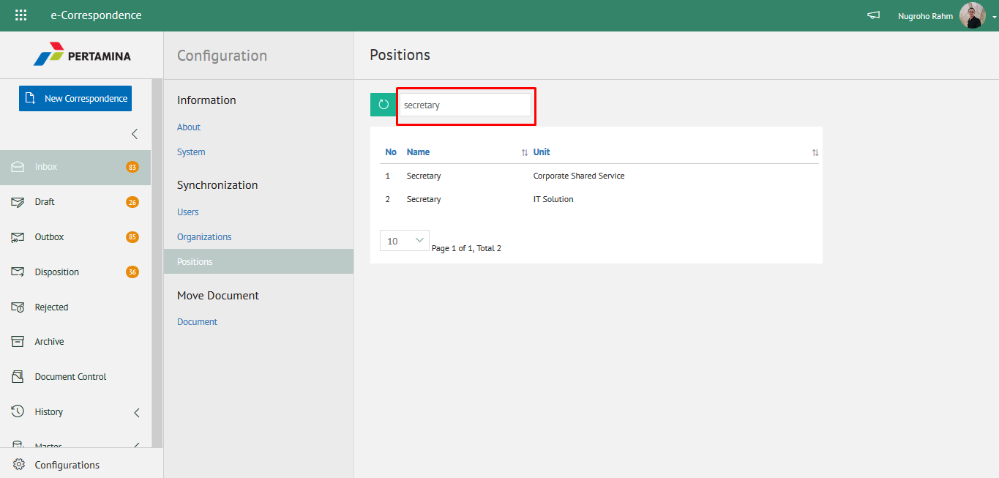

## **Konfigurasi**

Pada modul ini mendukung pengelolaan konfigurasi aplikasi eCorr meliputi informasi aplikasi, menampilkan informasi user, unit organisasi dan jabatan, pengelolaan pindah/*move* dokumen serta dapat melakukan konfigurasi notifikasi aplikasi eCorr

### 1. Melihat Informasi Aplikasi

**Role yang sesuai:**

- Admin eCorr

Admin eCorr dapat melihat informasi aplikasi. Langkah-langkah untuk melihat informasi aplikasi adalah sebagai berikut:

1. Pilih menu **Configuration** dan pilih submenu **Information - About**

2. Sistem akan menampilkan informasi aplikasi antara lain alamat email, display name, unit organisasi, nama organisasi, kota, provinsi, country ID, valid licensi detail dan lisensi
   

### 2. Mengelola Notifikasi Email

**Role yang sesuai:**

- Admin eCorr

Admin eCorr dapat mengelola notifikasi email yang dikirimkan kepada pengirim. Langkah-langkah untuk mengirimkan notifikasi email terkait perubahan aplikasi adalah sebagai berikut:

1. Pilih menu **Configuration** dan pilih submenu **Information - System**

2. Ketikkan nama pengirim pada kolom **Sender** dan checklist **Yes** pada bagian **Mail Notificatation** kemudian klik **Submit** untuk mengirimkan notifikasi ke email user

3. Sistem berhasil mengirimkan email notifikasi ke tujuan

3. Mengelola User pada Aplikasi

**Role yang sesuai:**

- Admin eCorr

Admin eCorr dapat mengelola user pada aplikasi eCorr yang sudah didaftarkan di IdProo. Informasi yang ditampilkan yaitu nama, alamat email dan no telepon. Pengelolaan user yang dilakukan oleh admin eCorr antara lain yaitu:

- Melihat daftar user pada aplikasi
- Mencari daftar user pada aplikasi
    
#### 3.1. *Melihat Daftar User pada Aplikasi*

Langkah-langkah untuk melihat daftar user adalah sebagai berikut:

1. Pilih menu **Configuration** dan pilih submenu **Syncronization - Users**

2. Sistem menampilkan daftar user pada aplikasi eCorr

#### 3.2. *Mencari User pada Aplikasi*

Langkah-langkah untuk mencari daftar user adalah sebagai berikut:

1. Pilih menu **Configuration** dan pilih submenu **Syncronization - Users**

2. Ketikkan kata kunci pada kolom pencarian kemudian klik **Enter**

3. Sistem menampilkan hasil pencarian berdasarkan kata kunci

### 4. Mengelola Unit Organisasi pada Aplikasi

**Role yang sesuai:**

- Admin eCorr

Admin eCorr dapat mengelola unit organisasi pada aplikasi eCorr yang sudah didaftarkan di IdProo. Informasi yang ditampilkan yaitu nama unit organisasi. Pengelolaan unit organisasi yang dilakukan oleh admin eCorr antara lain yaitu:

- Melihat daftar unit organisasi pada aplikasi
- Mencari daftar unit organisasi pada aplikasi
 
#### 4.1. *Melihat Daftar Unit Organisasi pada Aplikasi*

Langkah-langkah untuk melihat daftar unit organisasi adalah sebagai berikut:

1. Pilih menu **Configuration** dan pilih submenu **Syncronization - Organization**

2. Sistem menampilkan daftar user pada aplikasi eCorr. Admin eCorr juga dapat melihat daftar unit kerja dalam bentuk hirarki dengan klik pada icon **Tree**

3. Sistem menampilkan unit organisasi dalam bentuk hirarki

#### 4.2. *Mencari Unit Organisasi pada Aplikasi*

1. Pilih menu **Configuration** dan pilih submenu **Syncronization - Organization**

2. Ketikkan kata kunci pada kolom pencarian kemudian klik **Enter**

3. Sistem menampilkan hasil pencarian berdasarkan kata kunci

### 5 Mengelola Jabatan pada Aplikasi

**Role yang sesuai:**

- Admin eCorr

Admin eCorr dapat mengelola jabatan pada aplikasi eCorr yang sudah didaftarkan di IdProo. Informasi yang ditampilkan yaitu nama jabatan dan unit organisasi. Pengelolaan jabatan yang dilakukan oleh admin eCorr antara lain yaitu:

- Melihat daftar jabatan pada aplikasi 
- Mencari daftar jabatan pada aplikasi

#### 5.1. *Melihat Daftar Jabatan pada Aplikasi*

Langkah-langkah untuk melihat daftar jabatan adalah sebagai berikut:

1. Pilih menu **Configuration** dan pilih submenu **Syncronization - Position**

2. Sistem menampilkan daftar user pada aplikasi eCorr
    
#### 5.2. *Mencari Jabatan pada Aplikasi*

Langkah-langkah untuk mencari jabatan adalah sebagai berikut:

1. Pilih menu **Configuration** dan pilih submenu **Syncronization - Position**

2. Ketikkan kata kunci pada kolom pencarian kemudian klik **Enter**

3. Sistem menampilkan hasil pencarian berdasarkan kata kunci

### 6. Mengelola Pindah Dokumen Antar Unit Kerja

**Role yang sesuai:**

- Admin eCorr

Admin eCorr dapat mengelola pemindahan/*move *dokumen pada unit kerja satu ke unit kerja yang lain. Hal ini bertujuan jika unit kerja yang mengalami perubahan dan dokumen di unit kerja lama akan dipindahkan ke unit kerja yang baru. Pengelolaan pemindahan  dokumen yang dilakukan oleh admin eCorr antara lain yaitu:

- Melihat daftar dokumen
- Mencari dokumen
- Melihat Informasi Dokumen
- Melakukan pemindahan dokumen ke unit kerja lain

#### 6.1. *Melihat Daftar Dokumen*

Langkah-langkah untuk melihat daftar dokumen adalah sebagai berikut:

1. Pilih menu **Configuration** dan pilih submenu **Move Document - Document**

2. Sistem menampilkan daftar dokumen pada halaman **Move Document**
   
#### 6.2. *Mencari Dokumen*

Langkah-langkah untuk mencari dokumen adalah sebagai berikut:

1. Pilih menu **Configuration** dan pilih submenu **Move Document - Document**

2. Ketikkan kata kunci pada kolom pencarian kemudian klik **Enter**

3. Sistem menampilkan hasil pencarian berdasarkan kata kunci

#### 6.3. *Melihat Informasi Dokumen*

Langkah-langkah untuk melihat informasi dokumen adalah sebagai berikut:

1. Pilih menu **Configuration** dan pilih submenu **Move Document-Document**. Pilih salah satu dokumen yang akan dilihat informasinya

##### 6.3.1. Preview Surat masuk

Pada tab **Preview**, ditampilkan *preview* surat yang sudah dibuat. Preview surat disesuaikan dengan template berdasarkan jenis surat.

##### 6.3.2. Detail Surat

Pada tab **Detail**, terdapat informasi asal surat, perihal, file lampiran, kategori surat, resume, rekomendasi, nomor surat, klasifikasi surat, tanggal surat dan tujuan

##### 6.3.3. Tracking Surat

Pada tab **Tracking**, ditampilkan informasi *tracking* surat dalam bentuk *chart*

##### 6.3.4. History Surat

Pada tab **History Surat**, ditampilkan riwayat surat masuk yang terdapat informasi jabatan, tanggal, tindakan dan komentar

#### 6.4 Melakukan Pemindahan Dokumen ke Unit Kerja Lain

Langkah-langkah untuk melihat informasi dokumen adalah sebagai berikut:

1. Pilih menu **Configuration** dan pilih submenu **Move Document - Document**

2. PIlih dokumen yang akan dipindahkan ke unit kerja lain dan klik icon **Move**

3. Sistem menampilkan *pop up* **Move Document**

4. Pilih jabatan lama dimana dokumen berasal pada *field* **Jabatan Lama** Pilih jabatan baru pada *field* **Jabatan Baru** untuk memilih tujuan dokumen yang akan dipindahkan

5. Pilih **Submit** untuk memindahkan dokumen ke unit kerja yang baru

